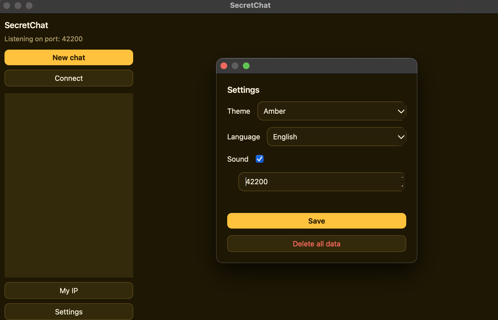
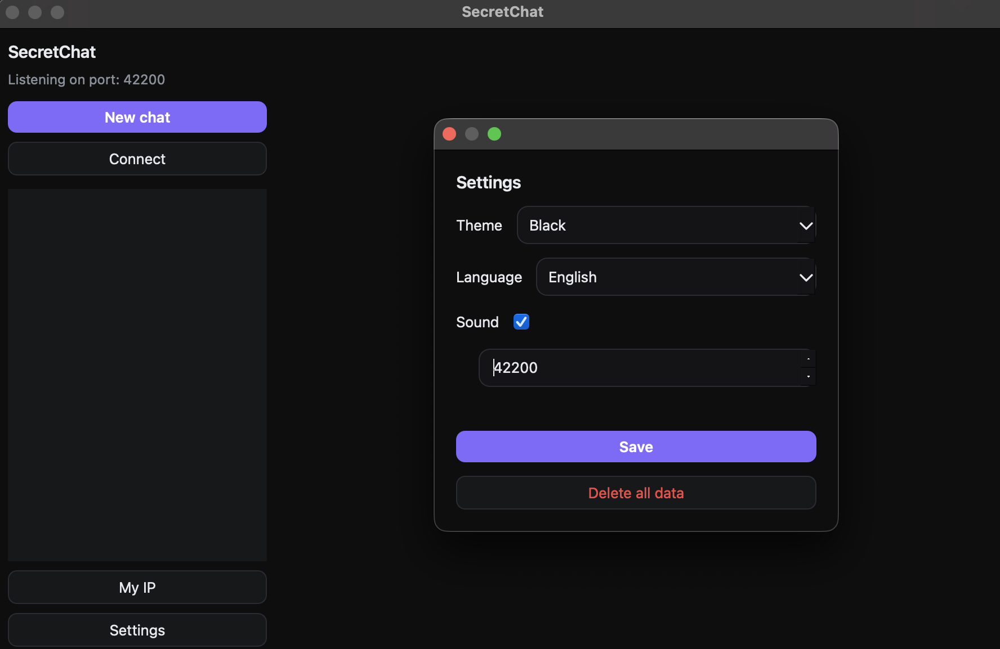
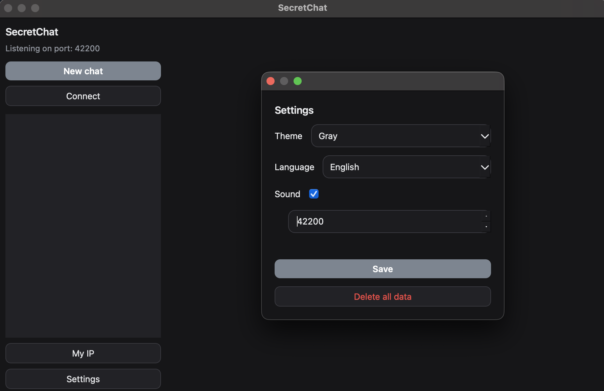
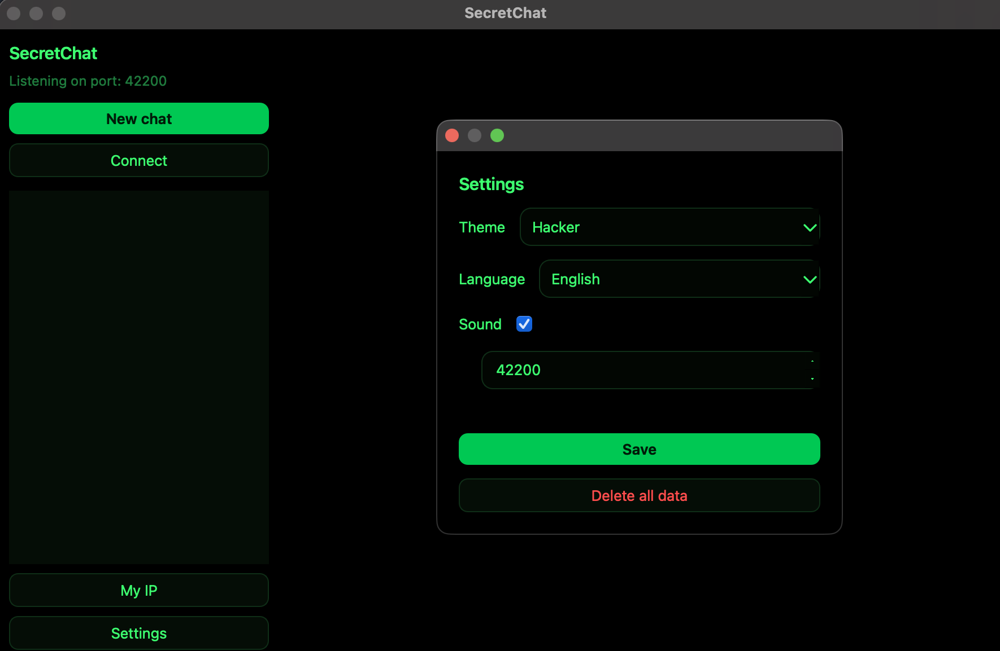
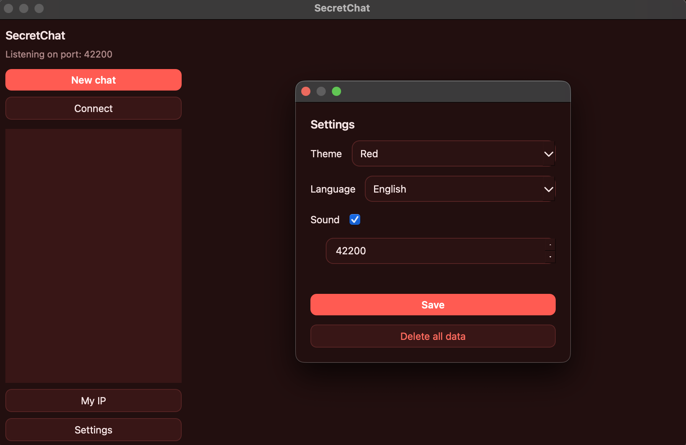
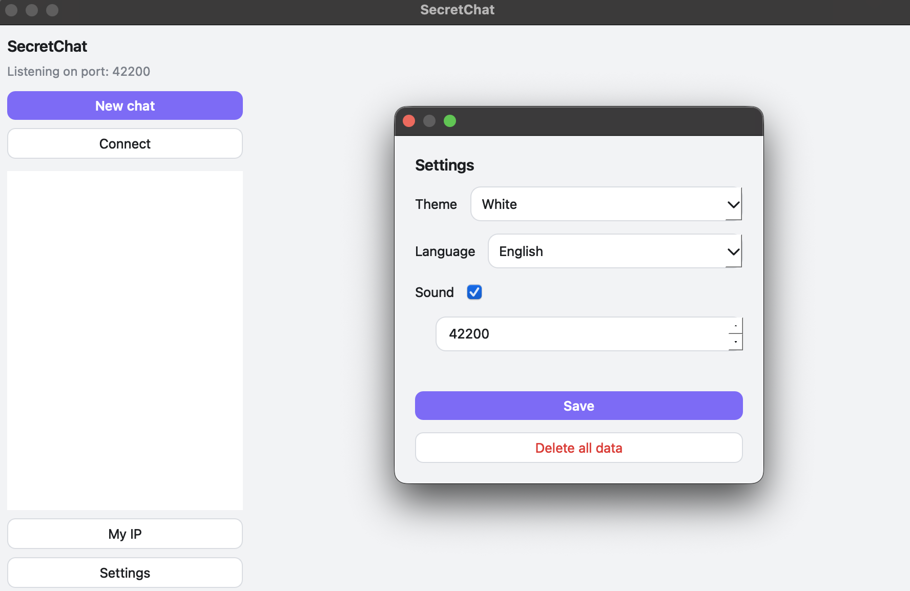

# SecretChat

> **Русская документация:** [README_RU.md](README_RU.md)

<p align="center">
  
</p>

A small, private, peer-to-peer encrypted messenger. No accounts, no servers, no
sign-ups — you connect **directly** to your friend's IP with a one-time code,
and every single chat uses its own fresh encryption key.

- **Direct P2P** — no server in the middle, everything flows straight between
  the two machines over TCP.
- **Encrypted end-to-end** — X25519 (ECDH) handshake + AES-256-GCM for every
  message. Each chat derives its own key, so a new chat = new encryption.
- **Ephemeral by design** — nothing is written to disk. Close the app and every
  chat is wiped **on both sides**. The chat creator can also set a self-destruct
  timer (5 min … 24 h), after which the chat erases itself everywhere.
- **14 themes**, RU/EN interface, sound notifications, text + files + images
  (paste a screenshot with Ctrl+V).
- Runs as a plain Python app, as a native **.exe / .app**, and inside
  **Docker** (GUI via noVNC in your browser — so it can run on any server).

---

## Downloads

Built binaries land in `dist/`:

| File                   | Platform | Built by                                     |
|------------------------|----------|----------------------------------------------|
| `dist/SecretChat.dmg`  | macOS    | `./build/build_macos.sh` + `./build/build_dmg.sh` |
| `dist/SecretChat.exe`  | Windows  | `build\build_windows.bat` (or the Nuitka one) |
| `dist/SecretChat`      | Linux    | `./build/build_linux.sh`                     |

When this project is on GitHub, every **Release** will attach the `.exe` and
`.dmg` automatically (see `.github/workflows/release.yml`) — check the repo's
*Releases* page first, and build locally only if you need a fresh snapshot.

---

## Screenshots

The app flow (two peers on the same LAN):


*Create a chat — set a self-destruct timer if you want, get the pairing code.*


*Show the code to your peer together with your IP.*


*The peer enters your IP and the code — the chat is established.*


*Text, files and images, encrypted end-to-end.*

Some of the built-in themes (the full list is in `config.py` → `THEMES`):













---

## Quick start (source)

```bash
python3 -m venv .venv
.venv/bin/pip install -r requirements.txt     # Windows: .venv\Scripts\pip ...
.venv/bin/python main.py                       # Windows: .venv\Scripts\python ...
```

Two people do this, then:

1. **Creator** clicks **New chat**, optionally picks a self-destruct timer, and
   gets an alphanumeric **code** (it looks like `AE56-OQBY-…-7PAU`). Show it to
   the peer together with your IP.
2. **Peer** clicks **Connect**, enters your **IP** and the **code**, done.

The code *is* a safety number: your public key is baked into it, so no one can
impersonate either side. You can find your own address under **My IP**.

---

## Docker

The container boots a virtual display (Xvfb), a VNC server, and noVNC — so the
GUI **opens automatically** and you reach it from any browser:

```bash
make up                       # build + start (or: docker compose up -d --build)
# open: http://localhost:6080/vnc.html    (VNC password: secret)
```

- **noVNC** `6080` — the app GUI in a browser tab.
- **VNC** `5900` — for any VNC client (same password).
- **P2P** `42000` — where others connect to you; publish it on the router/VPS
  firewall so peers from the internet can reach you.
- `config.py` is mounted as a volume — tweak it without rebuilding.

All settings (ports, VNC password, display size, theme, limits…) live in
`config.py` at the project root — edit it and restart. The VNC password is
`secret` by default (see `VNC_PASSWORD`).

---

## Building native apps

All build scripts create their own build venv (`.venv-build`), so your main
environment stays clean. The PyInstaller scripts share `secretchat.spec` (UPX
is off — it triggers antiviruses).

### Windows

**Nuitka (recommended)** — compiles Python into native code, so antiviruses
flag such an exe far less often than PyInstaller (no UPX, no temp extraction):

```
build\build_windows_nuitka.bat            # result: dist\SecretChat\SecretChat.exe
build\build_windows_nuitka.bat onefile    # or a single file: dist\SecretChat.exe
build\build_windows_nuitka.bat mingw      # build via MinGW instead of MSVC
```

You need Python in PATH and a C compiler — MSVC (Visual Studio Build Tools) or
MinGW-w64 (details at the top of the script).

**PyInstaller (fallback)**:

```
build\build_windows.bat                   # result: dist\SecretChat.exe
```

### macOS

```
chmod +x build/build_macos.sh
./build/build_macos.sh                    # result: dist/SecretChat.app
```

If you distribute the app, codesign it first (see comments in the script).

### Linux

```
chmod +x build/build_linux.sh
./build/build_linux.sh                    # result: dist/SecretChat
```

Needs `python3`, `python3-venv` and the Qt system libraries
(`sudo apt install build-essential libgl1 libegl1 libxkbcommon0` on
Debian/Ubuntu). Alternatively just run from source — see *Quick start*.

### Docker (no compilation on your machine)

Building inside a container is covered separately — see the **Docker** section
above (`make up`, GUI in your browser via noVNC).

> **About Windows "warnings".** Every unsigned exe (not just this one) gets the
> blue SmartScreen prompt — that's normal, and it is **not a virus**. Removing
> it for free is impossible (it needs a paid Microsoft certificate), so we chose
> Nuitka to stop antiviruses from *falsely* flagging the app, and prepared a
> note for users on what to click: **`docs/SMARTSCREEN_FAQ.md`** (and
> `docs/SMARTSCREEN_FAQ_RU.md`).

---

## Configuration

Everything is configurable from the threshold in **`config.py`**:

| Section     | What's there                                                                  |
|-------------|-------------------------------------------------------------------------------|
| `[APP]`     | name, version, default language/theme, sound, server auto-start               |
| `[NETWORK]` | P2P port, keepalive interval/timeout, connect timeout                         |
| `[SECURITY]`| max file size, chunk size, default self-destruct timer, code checksum on/off  |
| `[UI]`      | font size, bubble/image widths, window size, the list of 14 themes            |
| `[LOG]`     | logging on/off, level, file                                                   |
| `[DOCKER]`  | virtual display resolution, VNC password and ports                            |

Colors of the 14 themes live separately in **`secret_chat/themes.py`**
(`PALETTES`) — each theme is a dictionary of 14 colors (`bg`, `panel`,
`header`, `input`, `me`, `them`, `text`, `dim`, `accent`, `border`, `hover`,
`danger`, plus `me_fg` / `accent_fg` for text on colored surfaces); copy one,
tweak the colors, and add its id to `THEMES` in `config.py`.

---

## How the encryption works

1. The **creator** generates an X25519 keypair. Its public key is packed into
   the pairing code together with a checksum (`base32`, grouped with dashes).
2. The **peer** generates its own keypair and, at the handshake, sends the
   public part to the creator.
3. Both sides compute the same shared secret via ECDH and derive an AES-256 key
   with HKDF (salted by the code).
4. After the handshake **everything** is AES-GCM with a fresh nonce per frame:
   text, file chunks, even the pings.
5. The pairing code doubles as authentication — a MITM would need a keypair
   matching the code, which is computationally impossible.

A chat lives only in RAM. When you close the app, the socket dies, and the
other side sees the disconnect and erases the chat too. With a self-destruct
timer, both sides count down and wipe together at zero.

## Privacy notes

- No accounts, no registration, no telemetry, no external requests at app
  startup.
- Nothing is stored on disk: history, keys, and received files are in memory
  only (partial downloads use a temp file that is deleted on cancel/failure).
- The optional **Public IP** button in *My IP* sends a standard STUN request to
  `stun.l.google.com` (a normal P2P step) — it is opt-in.
- Keepalive traffic exists so dead links are detected and chats are erased
  properly.

## Network notes

On a **LAN** it always works. Over the internet, the side that receives
connections needs its port forwarded (`42000`) or UPnP enabled — if both sides
are behind NAT without any of that, TCP cannot be established (a property of
the internet, not of this app).

---

## Tests

```bash
.venv/bin/python tests/test_e2e.py        # core: crypto, handshake, chat flow
QT_QPA_PLATFORM=offscreen .venv/bin/python tests/test_ui_smoke.py   # two windows
```

---

## Project layout

```
config.py               # THE configuration file — edit from the threshold
main.py                 # entry point
secret_chat/
  crypto.py             # X25519, AES-GCM, HKDF, pairing codes
  protocol.py           # TCP frame format
  network.py            # TCP server/client, keepalive
  manager.py            # chat state, handshake, self-destruct, erase logic
  i18n.py               # RU/EN strings
  themes.py             # the 14 color themes + QSS builder
  sound.py              # synthesized beep
  prefs.py              # runtime settings overriding config.py
  ui/                   # PySide6 interface
docker/entrypoint.py    # Xvfb + x11vnc + noVNC + app auto-start
tests/                  # headless core + UI tests
build/                  # builds: Nuitka (Windows), PyInstaller (Win/macOS/Linux), dmg
dist/                   # ready binaries: .app / .dmg / .exe
docs/                   # SmartScreen/antivirus note (EN/RU)
```

---
*Not affiliated with or endorsed by Toxic/Chitchat or similar apps. Just a
small, clean, P2P encrypted chat.*
